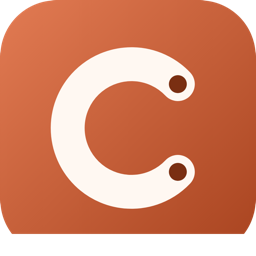

  

# Claude Code Toolkit — VS Code

Health monitoring, session rescue, prompt queue, and dashboard for [Claude Code](https://claude.ai/code), right in the VS Code sidebar.

## TL;DR — what it does

- **Status bar:** live health indicator. Click it to run a health check.
- **Sidebar → Health / Sessions / Starred / Maintenance:** browse, star, export, archive, delete.
- **Sidebar → Prompt Queue:** queue prompts for when you hit a usage cap; auto-fires when the cap resets.
- **Right-click any session → Fix Oversized Content / Unstick Session:** rescue sessions stuck on `PDF too large` (issue #13518).

## Install

1. Install the [npm CLI](https://www.npmjs.com/package/@asifkibria/claude-code-toolkit): `npm i -g @asifkibria/claude-code-toolkit`
2. Install this extension from the VS Code Marketplace.
3. Look for the Claude Toolkit icon in the Activity Bar.

## Settings

| Setting | Default | What it does |
|---|---|---|
| `claudeToolkit.showStatusBar` | `true` | Show health in the status bar |
| `claudeToolkit.autoRefresh` | `true` | Auto-refresh sidebar |
| `claudeToolkit.refreshInterval` | `60` | Refresh interval (seconds) |
| `claudeToolkit.showNotifications` | `true` | Notify on issues |
| `claudeToolkit.autoOpenDashboard` | `false` | Open dashboard at VS Code startup |
| `claudeToolkit.dashboardPort` | `1405` | Dashboard port |
| `claudeToolkit.defaultSendTarget` | `ask` | Where queued prompts go: `ask` / `chat` / `terminal` |

## Send queued prompts to chat or terminal

When you click a queued prompt, the extension asks where to send it:

- **Chat:** copies the prompt to clipboard, focuses the Claude Code chat panel — paste with Cmd/Ctrl+V.
- **Terminal:** writes the prompt to a temp file and pipes it into `claude` (multi-line safe).

Set `claudeToolkit.defaultSendTarget` to skip the prompt next time.

## License

MIT · [GitHub](https://github.com/asifkibria/claude-code-toolkit-vscode) · [npm CLI](https://www.npmjs.com/package/@asifkibria/claude-code-toolkit)
